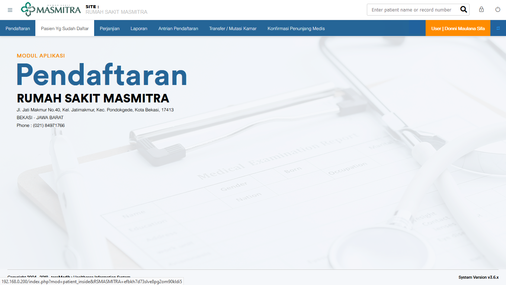
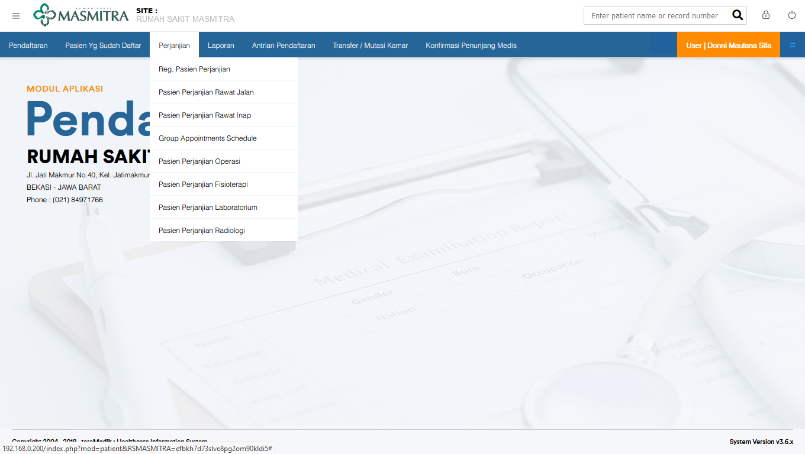
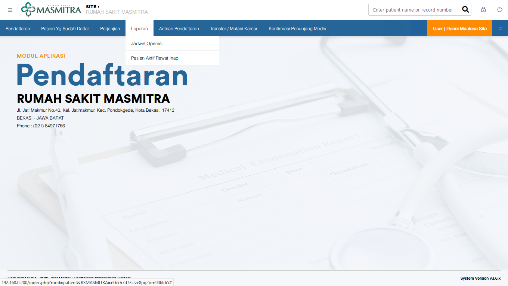

# Menu di TeraMedik

Berikut adalah menu di TeraMedik beserta penjelasannya

## Menu Pendaftaran

menu pendaftaran

**belum ada gambar**

## Menu Pasien yang sudah Daftar

> Memberikan informasi atau menu untuk mencari pasien yang sudah didaftarkan oleh bagian pendaftaran

## Menu Perjanjian

1. Reg Pasien Perjanjian

   > Menu untuk mendaftarkan pasien pribadi/asuransi ke dokter spesialis

2. Pasien Perjanjian Rawat Jalan

   > *Pembuat lupa mengenai menu ini*

3. Pasien Perjanjian Rawat Inap

   > *Pembuat lupa mengenai menu ini*

4. Group Appointments Schedule

   > *Pembuat belum mengetahui menu ini*

5. Pasien Perjanjian Operasi

   > *Pembuat belum mengetahui menu ini*

6. Pasien Perjanjian Fisioterapi

   > *Pembuat belum mengetahui menu ini*

7. Pasien Perjanjian Laboratorium

   > *Pembuat belum mengetahui menu ini*

8. Pasien Perjanjian Radiologi

   > *Pembuat belum mengetahui menu ini*

## Menu Laporan

1. Jadwal Operasi

   > *Pembuat belum mengetahui menu ini*

2. Pasien

   > *Pembuat belum mengetahui menu ini*

## Menu Antrian Pendaftaran

1. Kios Antrian

   > Kios Antrian digunakan oleh bagian IT

2. Plasma Antrian

   > Memunculkan antrian pasien di rumah sakit masmitra

## Menu Transfer / Mutasi Kamar

Transfer / Mutasi Kamar

**belum ada gambar**

## Menu Konfirmasi Penunjang Medis

Konfirmasi Penunjang Medis

**belum ada gambar**
