# Informasi Pasien

Berikut adalah contoh informasi seorang pasien

## Data Identitas

Pada saat membuka informasi pasien, yang pertama muncul adalah bagian Data Identitas

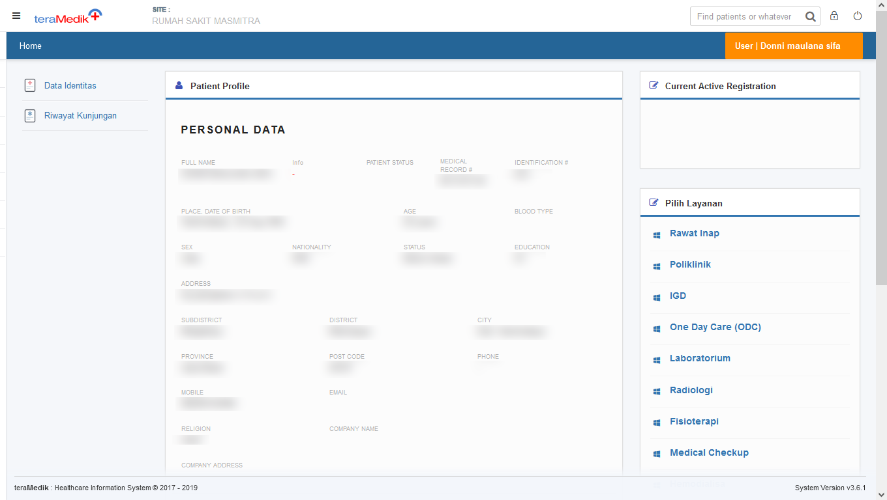

## Riwayat kunjungan pasien satu bulan terakhir

Riwayat kunjungan pasien dapat dilihat dengan klik menu Riwayat kunjungan di sebelah kiri

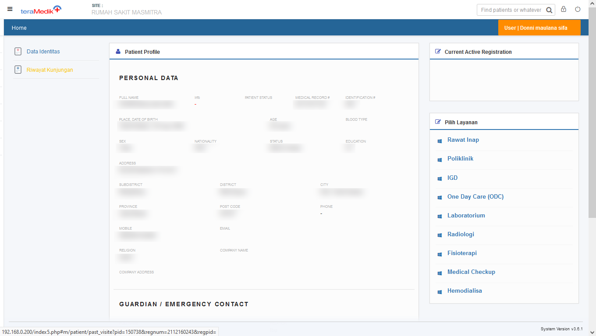

Setelah menu tersebut di buka, maka contohnya akan tampi seperti berikut, berarti pasien tersebut telah datang ke rs selama sebulan terakhir sebanyak satu kali. namun, apabila terlihat kosong, bisa dilihat di menu dibawahnya, [riwayat kunjungan pasien dari tanggal tertentu](./teramedik/datapasien.html#riwayat-kunjungan-pasien-dari-tanggal-tertentu).

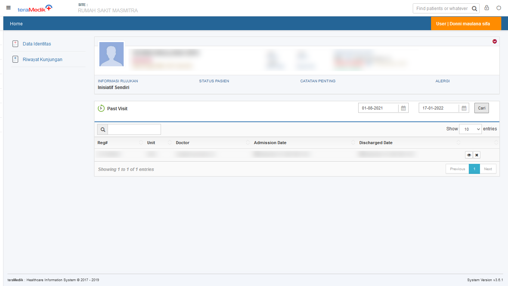

## Riwayat kunjungan pasien dari tanggal tertentu

apabila setelah membuka riwayat kunjungan ternyata tidak ditemukan datanya, seperti dibawah ini

Perhatikan bagian Past Visit, kemudian edit tanggal pertama pencarian kunjungan pasien

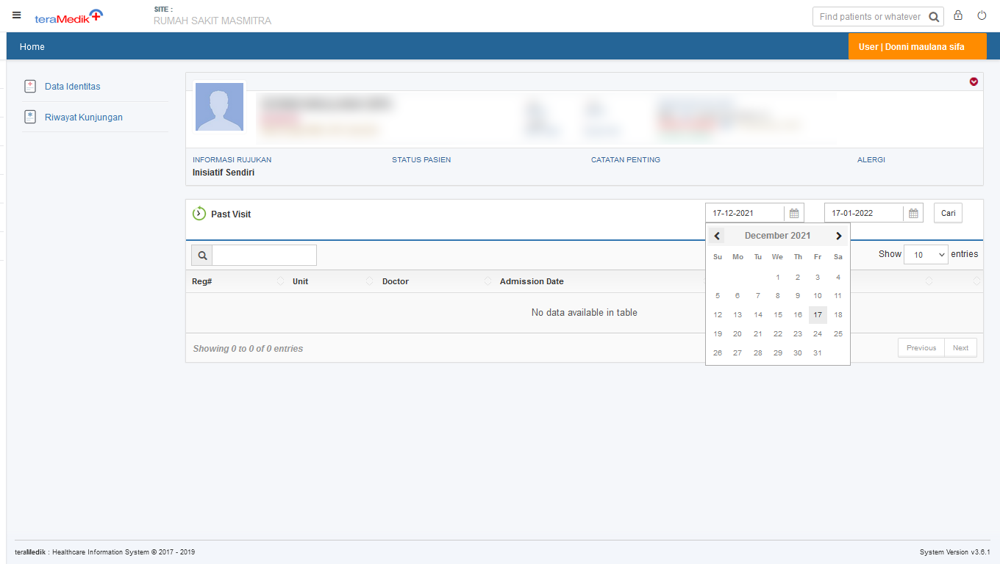

Setelah ditentukan tanggalnya, klik cari yang ada di sampingnya

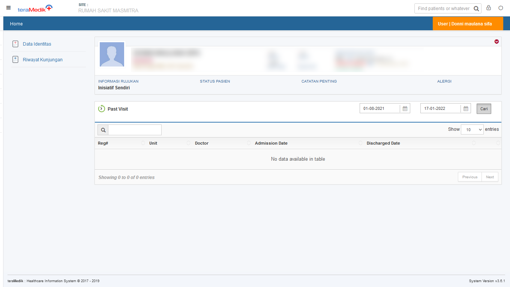

Maka hasil riwayat kunjungan pasien akan muncul seperti dibawah ini, artinya pasien telah berobat di rs masmitra selama satu kali dari tanggal yang telah ditentukan sebelumnya. namun apabila masih kosong, dapat dicoba untuk mencarinya dengan tanggal pertama yang lebih awal lagi, dan apabila masih kosong, ada kemungkinan pasien hanya terdaftar tapi belum pernah berobat, namun ada kemungkinan juga pasien terdaftar dengan dua Rekam Medis.

## Melihat informasi riwayat kunjungan pasien

untuk melihat informasi riwayat kunjungan pasien, dapat dengan mengklik simbol mata pada kunjungan yang dituju.

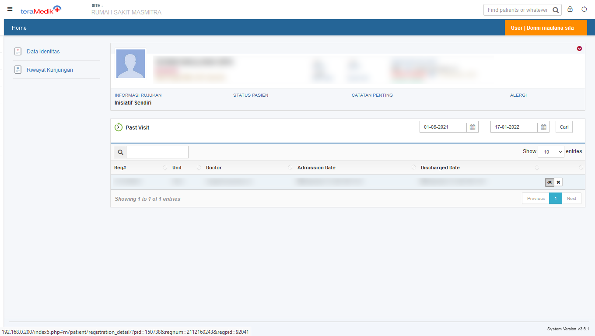

Ada beberapa informasi yang bisa di dapatkan pada bagian ini seperti dokter pemeriksa, rujukan pasien, asuransi yang digunakan (apabila ada), diagnosanya (apabila ada), dan siapa yang mendaftarkan pasien tersebut.

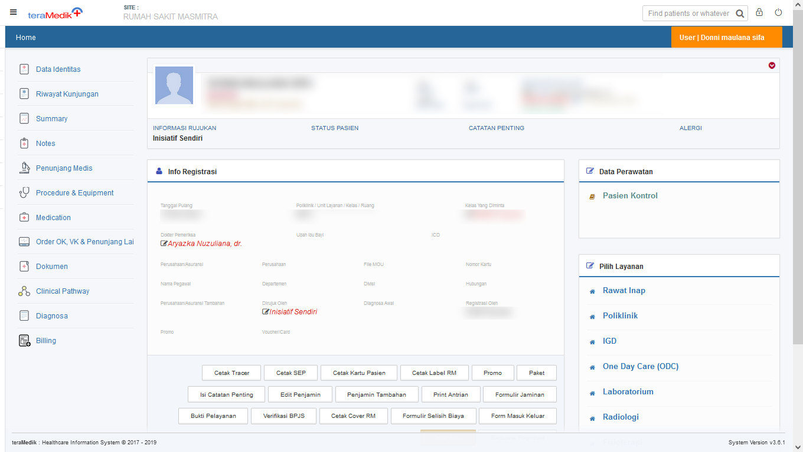

Berikut adalah menu summary dari pasien tersebut

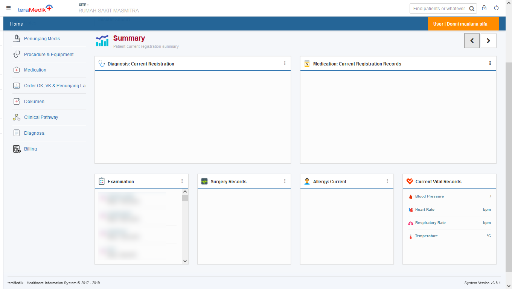

Berikut adalah menu penunjang medis (atau medication barangkali saya lupa/keliru) dari pasien tersebut. pada bagian ini apabila terdapat hasil laboratorium, kita dapat melihatnya dengan mengklik simbol (+) yang berwarna hijau.

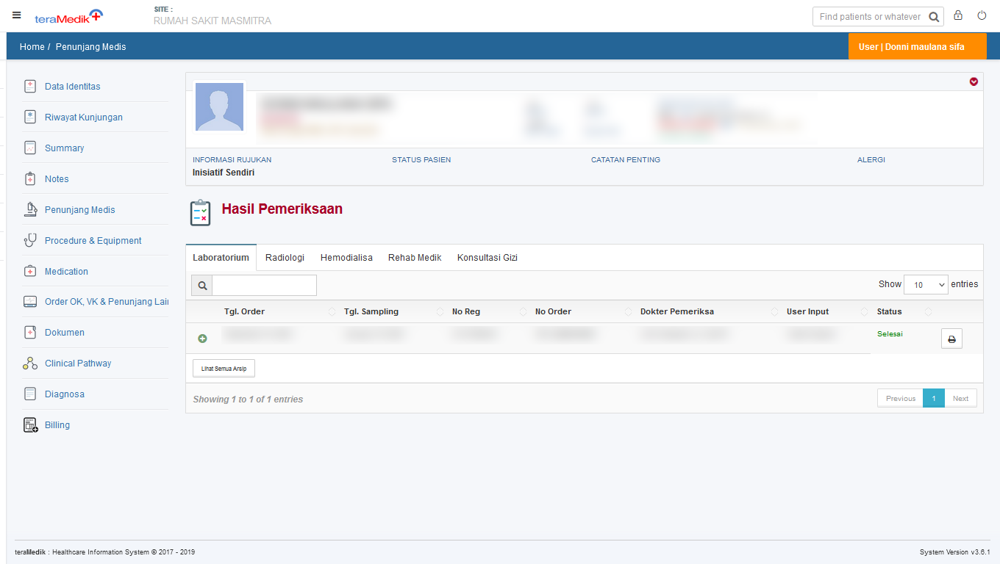

berikut adalah hasil laboratorium dari pasien tersebut.

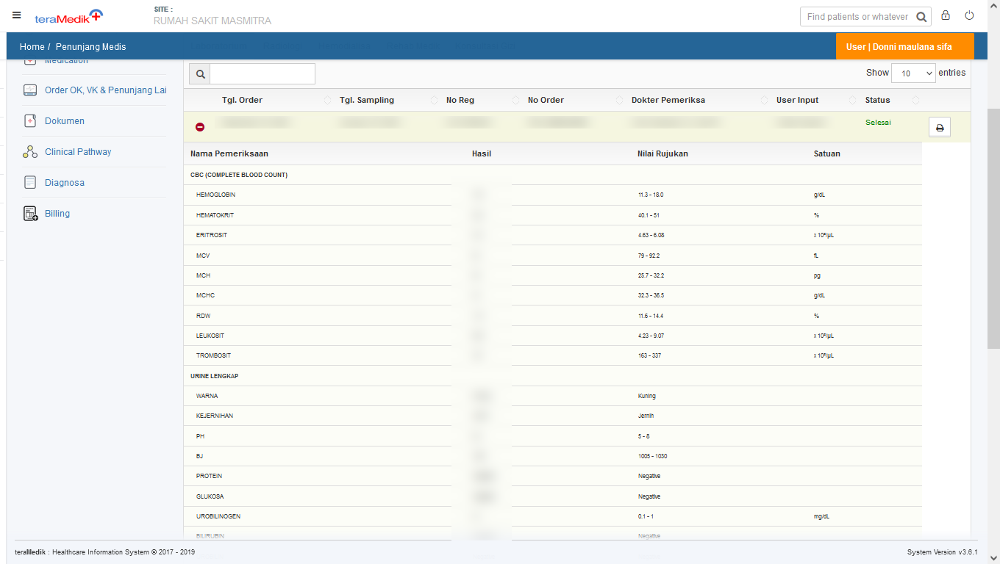

hal serupa dapat dilakukan pada menu Radiologi.

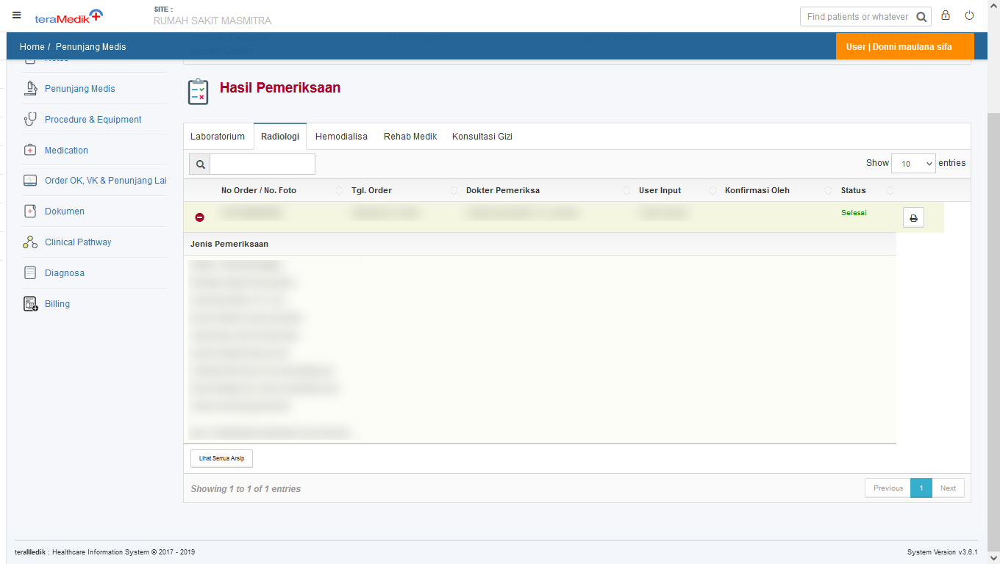

## Riwayat Kunjungan Pasien Asuransi

Untuk dapat melihat nomor kartu pasien asuransi, dapat dilihat juga pada bagian riwayat kunjungan

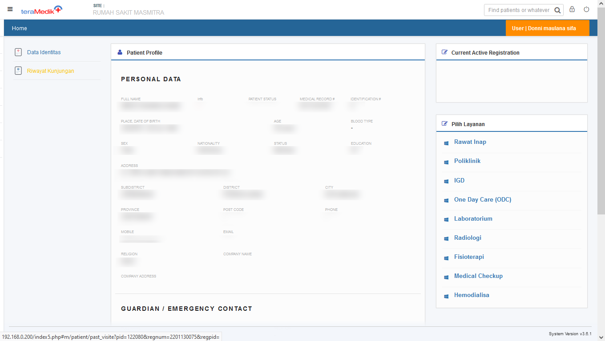

Kemudian buka riwayat kunjungan pasien tersebut, apabila kunjungan yang pertama tidak terinfo nomor kartu asuransi, dapat dilihat pada kunjungan yang lain

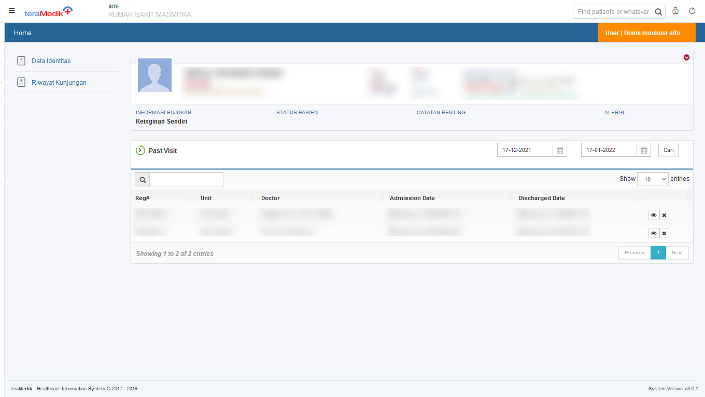

Di menu ini, kita dapat melihat asuransi yang digunakan oleh pasien tersebut beserta nomor kartunya.

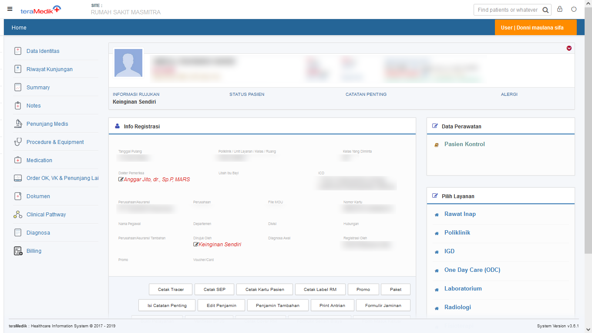

## Informasi Pasien Pribadi, Asuransi, atau BPJS

Untuk pasien yang sudah didaftarkan, berikut adalah contoh pasien terdaftar dengan pembayaran pribadi

berikut adalah contoh pasien terdafatar dengan pembayaran menggunakan asuransi

berikut adalah contoh pasien terdafatar dengan pembayaran menggunakan bpjs

*belum ada gambar*

akan tetapi, jika masuk igd, pasien bpjs terdaftar seperti dibawah ini

*belum ada gambar*