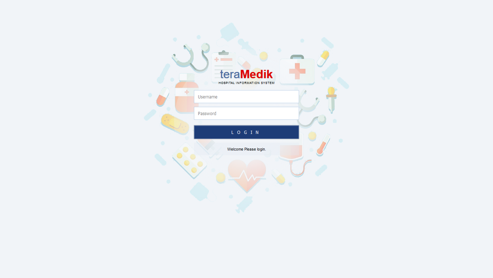
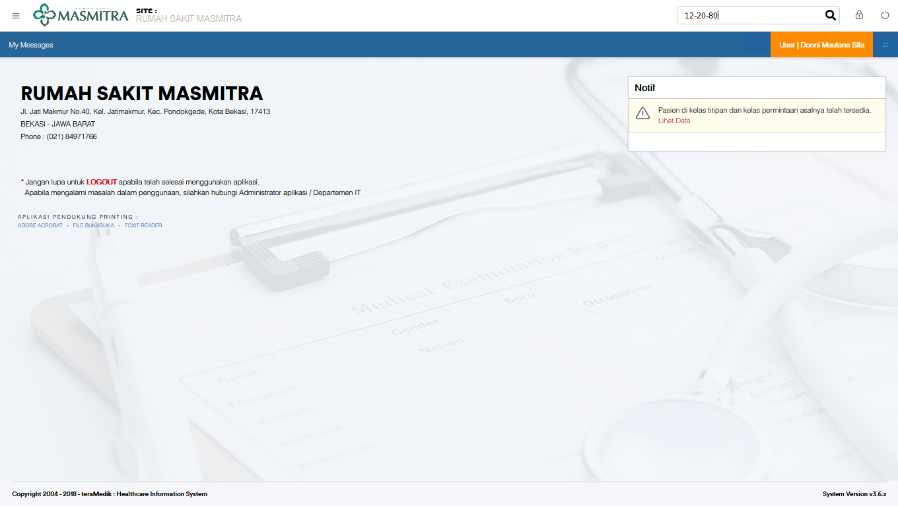
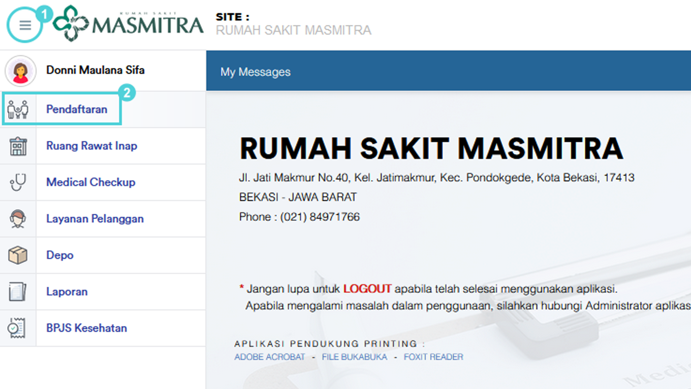
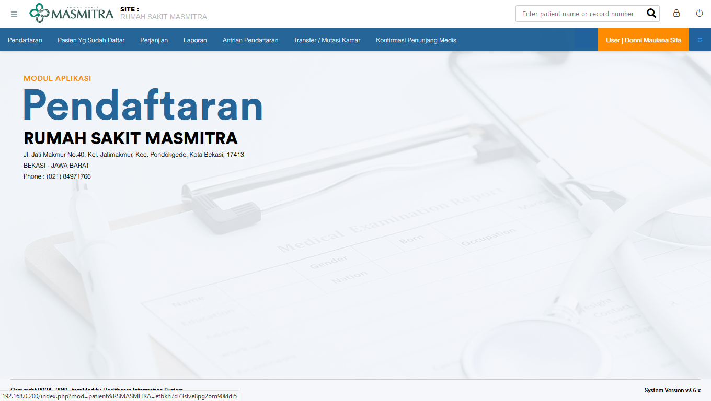

# Masuk ke TeraMedik

Akun TeraMedik diperlukan untuk mengakses menu yang tersedia. berikut tampilan masuk dari TeraMedik

## Bagian Pendaftaran

Setelah login di TeraMedik, tampilannya akan menjadi seperti gambar dibawah ini

Untuk mengakses bagian pendaftaran, klik 3 garis di pojok kiri atas, lalu pilih bagian "Pendaftaran"

Berikut adalah tampilan depan bagian pendaftaran.

