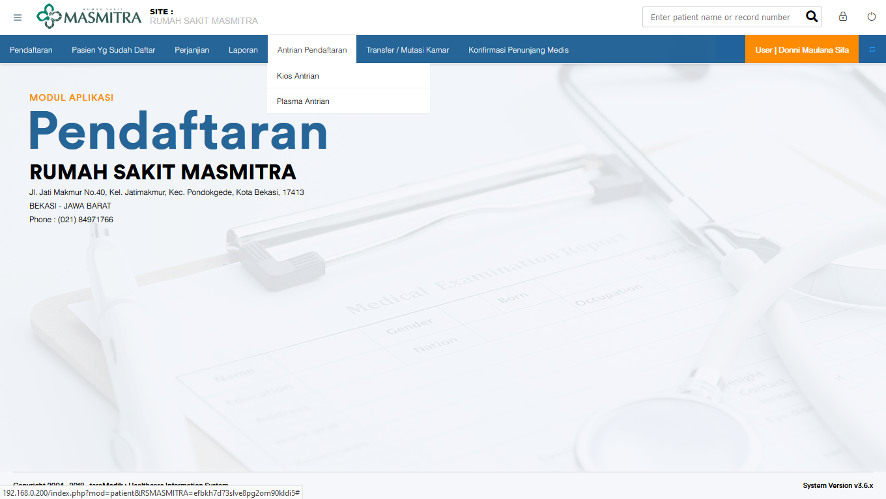
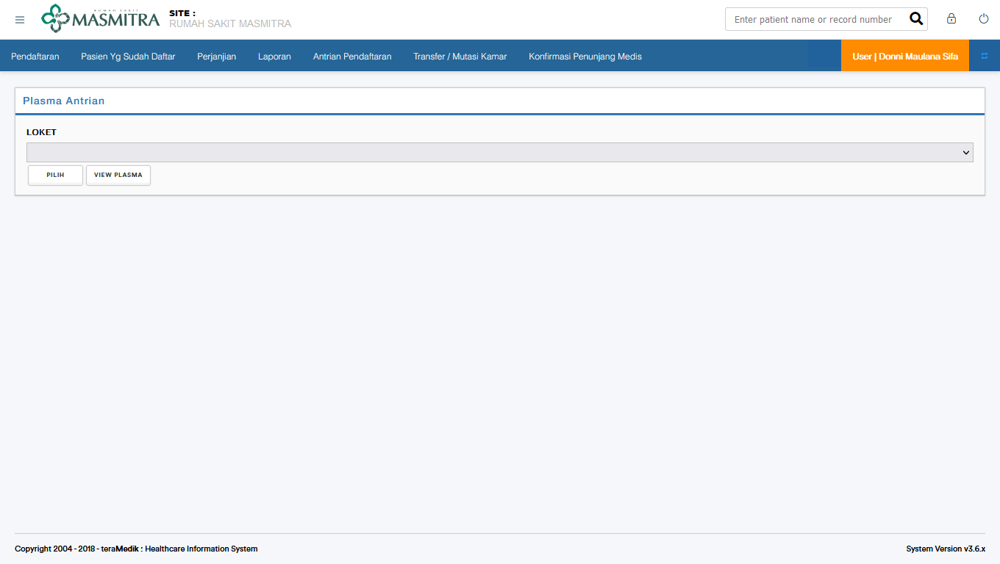
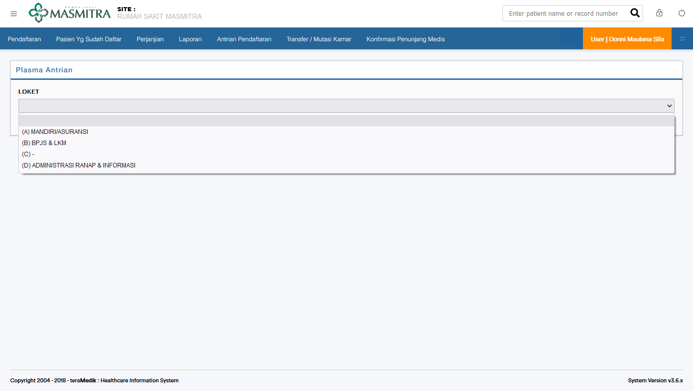
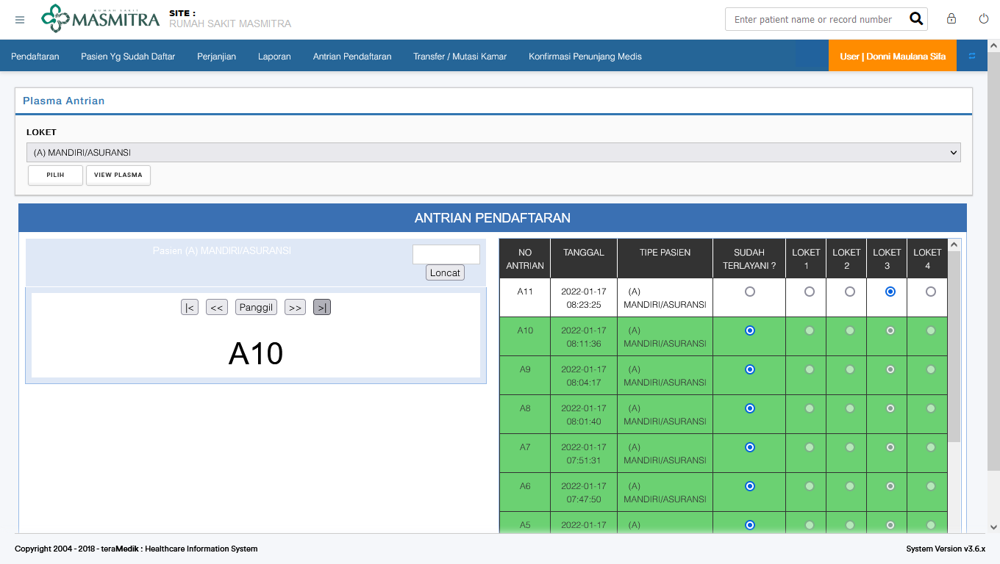
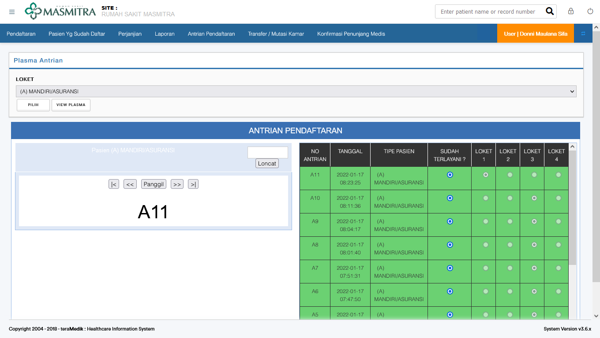
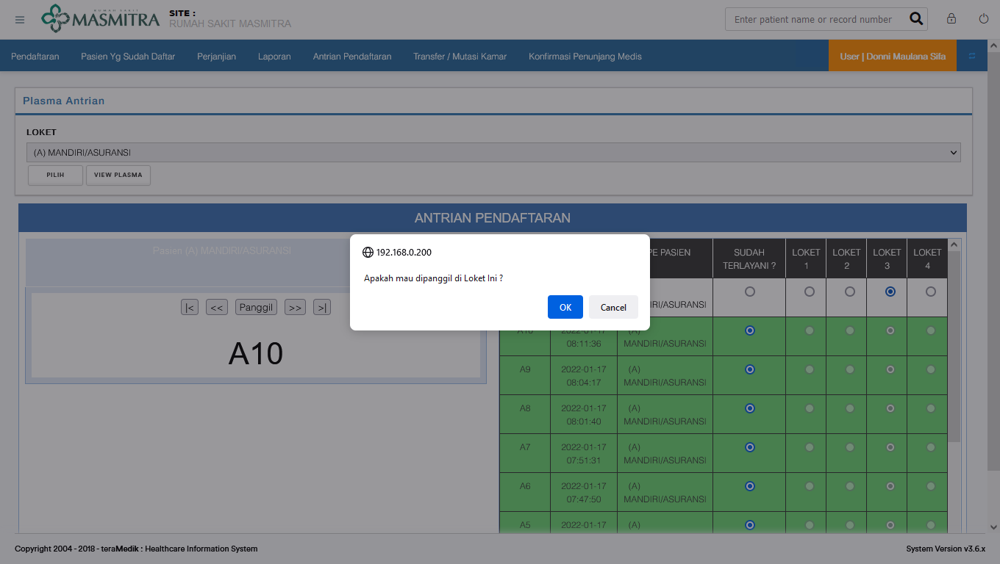
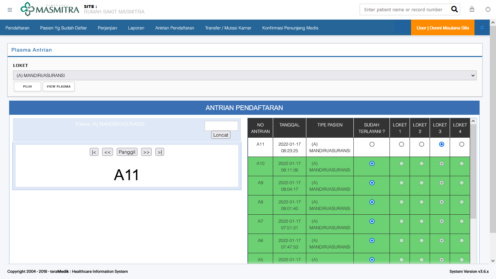
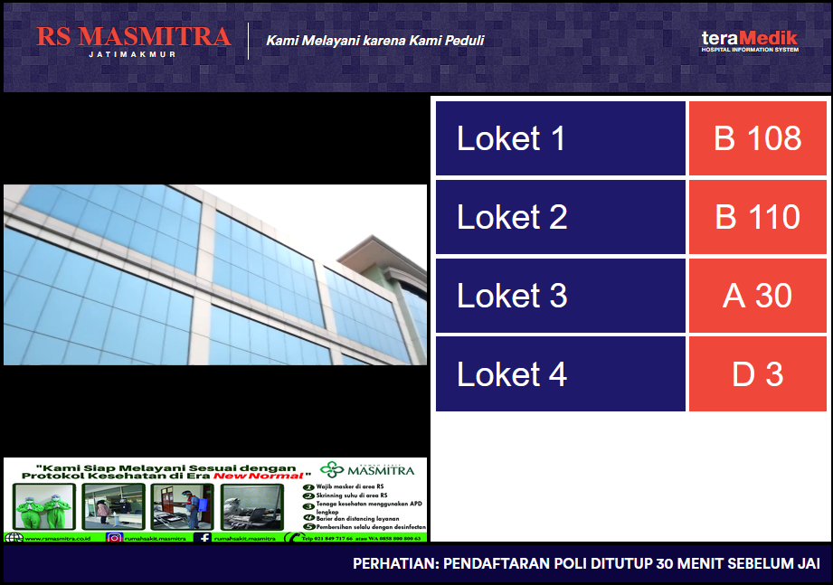

# Memanggil Pasien

Submenu dari antrian pendaftaran ada 2

1. Kios Antrian

   > Kios Antrian digunakan oleh bagian IT

2. Plasma Antrian

   > Memunculkan antrian pasien di rumah sakit masmitra

Bagian pendaftaran, gunakan submenu kedua yaitu Plasma Antrian

## Plasma Antrian

Berikut adalah tampilan awal dari bagian plasma antrian

Bagian pendaftaran dapat memilih loket A Pribadi/Asuransi, atau loket B BPJS/LKM

Setelah memilih loket A atau Loket B, berikut adalah contoh dari loket A, bagian yang hijau adalah informasi bahwa pasien tersebut telah dipanggil, contoh dari gambar ini, pasien dengan nomor antrian A11 atau pasien dengan nomor antrian berlatar belakang putih memberi informasi pasien tersebut belum dipanggil, sedangkan pasien dengan nomor Antrian A5 hingga A10 atau yang berlatar hijau telah dipanggil, dan dipanggilnya di Loket 3.

## Memanggil Nomor Antrian Pasien

Perhatikan nomor yang tertera pada bagian kiri.

Dua simbol yang ada pada samping kanan "Panggil", memiliki arti yang pertama nomor naik satu tingkat, dan yang kedua naik sampai antrian paling atas. Untuk berpindah dari A10 ke A11 dapat menggunakan simbol yang pertama dan dapat menggunakan simbol yang kedua disamping "Panggil".

Setelah simbol panah di klik 

Kemudian klik "panggil", maka pasien A11 akan dipanggil untuk menuju loket 1, dan baris A11 akan menjadi berlatar hijau

## Panggil pasien di Loket lain

Pasien A11 akan dipanggil di loket 3, maka klik lingkaran dibawa loket 3 pada kolom A11.

Akan ada konfirmasi, klik "ok"

sama seperti sebelumnya, dua simbol yang ada pada samping kanan "Panggil", memiliki arti yang pertama nomor naik satu tingkat, dan yang kedua naik sampai antrian paling atas. Untuk berpindah dari A10 ke A11 dapat menggunakan simbol yang pertama dan dapat menggunakan simbol yang kedua disamping "Panggil".

Setelah simbol panah di klik 

Kemudian klik "panggil", maka pasien A11 akan dipanggil untuk menuju loket 3, dan baris A11 akan menjadi berlatar hijau

## View Plasma

Menu ini akan memunculkan loket 1 sampai 4 beserta nomor antrian terakhir yang dipanggil.

