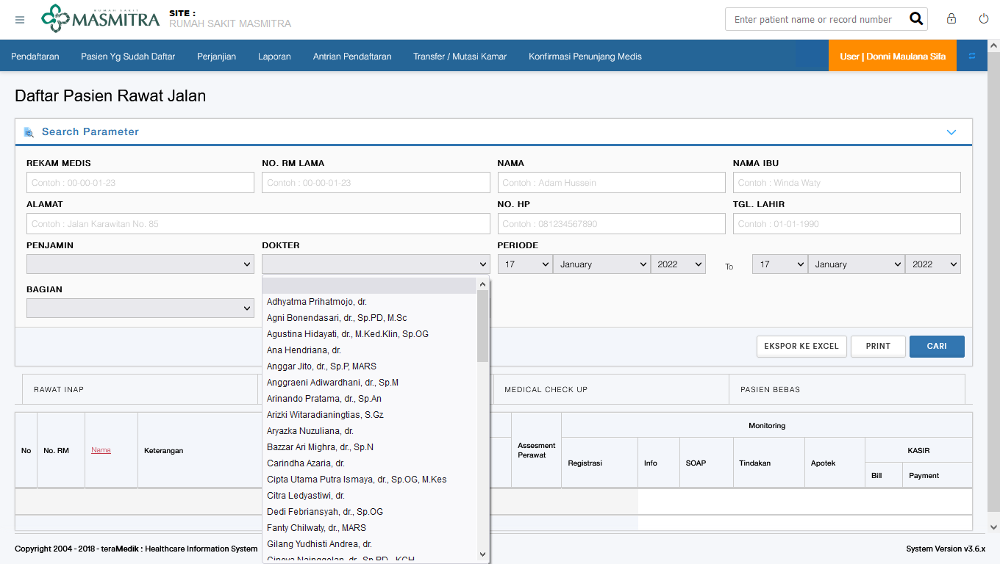
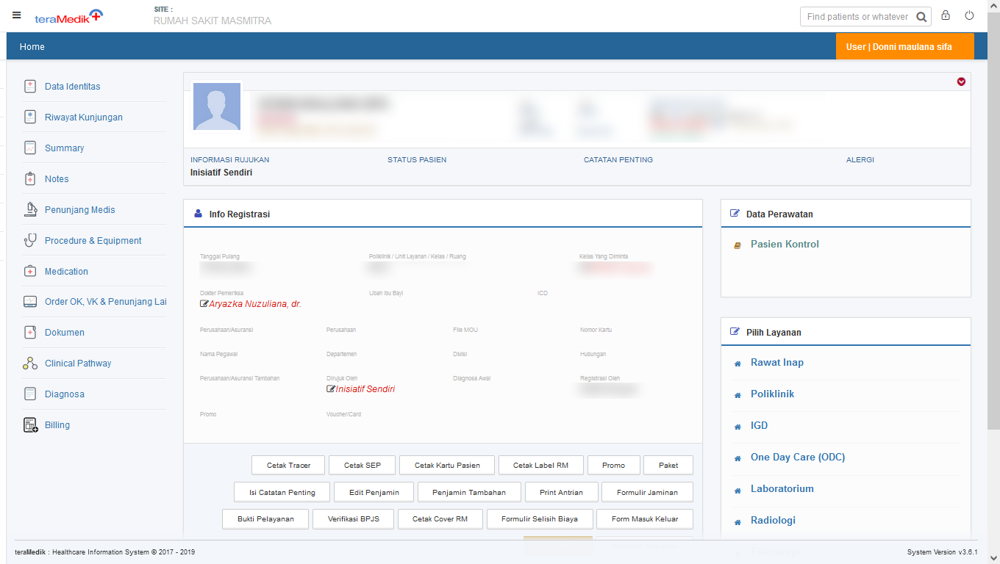

# Mencari Pasien Yang Sudah Mendaftar

ada banyak cara untuk mencari pasien yang sudah mendaftar

## Mencari Pasien Berdasarkan Dokter Tujuan

untuk pasien yang sudah didaftarkan, berikut adalah contoh pasien terdaftar dengan pembayaran pribadi

